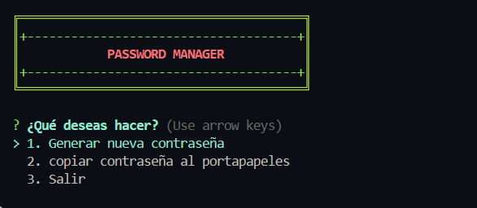

# 🔐 Password Manager - Consola interactiva con Node.js

## 📌 Descripción del problema

Hoy en día es fundamental tener contraseñas seguras para proteger nuestras cuentas, pero muchas personas:
- Reutilizan contraseñas inseguras.
- No las gestionan adecuadamente.
- No saben cómo generarlas de forma rápida y confiable.

Este proyecto resuelve ese problema con una **aplicación de consola interactiva en Node.js** que permite generar y copiar contraseñas seguras directamente al portapapeles.

---

## 📚 Librería utilizada

### 1. [`generate-password`](https://www.npmjs.com/package/generate-password)
Permite crear contraseñas con reglas personalizadas (símbolos, números, mayúsculas, longitud, etc.).

### 2. [`chalk`](https://www.npmjs.com/package/chalk)
Permite dar color y estilo al texto en consola (verde, rojo, negrita, fondos, etc.).

### 3. [`inquirer`](https://www.npmjs.com/package/inquirer)
Permite crear menús interactivos en la consola con listas, inputs y confirmaciones.

### 4. [`clipboardy`](https://www.npmjs.com/package/clipboardy)
Permite copiar texto directamente al portapapeles desde Node.js.

---

## ⚙️ ¿Cómo se implementó?

- Se creó un menú interactivo usando `inquirer`.
- El usuario puede elegir entre:
  - **Generar nueva contraseña** (con configuraciones personalizadas).
  - **Copiar al portapapeles**.
  - **Salir del programa**.
- Las contraseñas son generadas usando `generate-password`, y visualizadas con `chalk`.
- Todo se ejecuta en consola usando Node.js.

---

## 📥 Instrucciones de instalación

### 1. Clonar el repositorio

```bash
git clone https://github.com/tu-usuario/password-manager
```

2. Instalar dependencias
``` bash
npm install
```
3. Ejecutar la aplicación
```bash
node main.js
```
🖼️ Captura de pantalla



